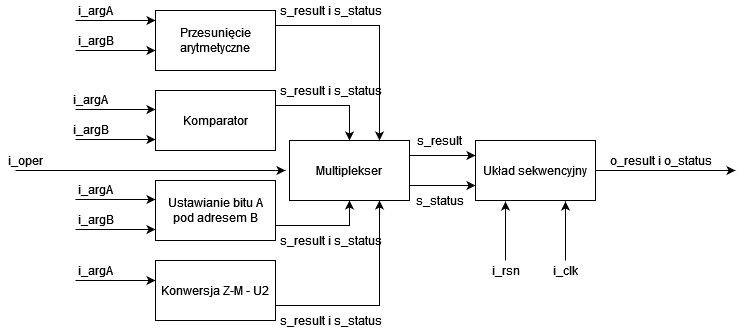
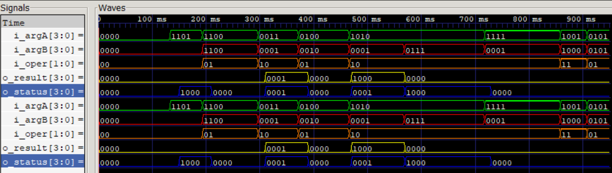

# Projekt indywidualny - Jakub Bartuszek, 318490

## 1. Wejścia i wyjścia 
Projekt zawiera zmienne wejściowe:
1. i_oper (2 bity) - Kontroluje jakie operacje są wykonywane.
2. i_argA i i_argB (dowolna ilość bitów - domyślnie 4) - Dane wejściowe argumentów A i B.
3. i_clk (1 bit) - Wejście zegara - przy narastaniu tego zbocza jest wykonywana większość operacji w module.
4. i_rsn (1 bit)- Reset synchroniczny - powoduje wyzerowanie rejestrów i watości funkcji, gdy wartość bitu wynosi 0.

Projekt zawiera zmienne wyjściowe:
1. o_result (tyle samo bitów co wejścia i_argA i i_argB) - Dane wyjściowe modułu.
2. o_status (4 bity) - wyjście informujące o ewentualnych błędach lub innych informacjach:
    * Pierwszy bit - ERROR - błąd operacji, wartość o_result jest nieokreślona.
    * Drugi bit - ONES - wszystkie bity wyjścia o_result to 1.
    * Trzeci bit - OVERFLOW - nastąpiło przepełnienie wyjścia, przez co nie można zapisać prawidłowej wartości wyjścia.
    * Czwarty bit - ODD - w wyniku jest nieparzysta ilość jedynek.

Dodatkowo, projekt zawiera zmienne wewnętrzne, potrzebne do prawidłowego działania układu sekwencyjnego:

* q_result - wyjście zawierające wynik układu kombinacyjnego.
* q_status - wyjscie zawierające informacje o ewentualnych błędach lub innych informacjach.

##  2. Realizowane operacje

1. Przesunięcie arytmetyczne A w prawo o wartość B (00)

Podmoduł przesuwa A w zależności od wartości B, B musi być liczbą ujemną - w przeciwnym wypadku skutkuje to błędem.
   
2. Porównanie arytmetyczne wejść A i B (01)

Moduł porównuje wartości A i B, jeżeli A>B to podaje wartość 1, w przeciwnym wypadku podaje 0.
   
3. Ustawienie bitu A pod adresem B na 0 (10)

Moduł podmienia wartość bitu A pod adresem B na 0. 
   
4. Konwersja znak-moduł na U2 (11) 
    
Moduł konwertuje liczbę z kodu znak-moduł na kod U2.

## 3. Schemat blokowy


## 4. Przykładowe użycie modułu
```
exe_unit_w15 #(.ARG_BITS(BITS))
exe_unit_w15     (.i_oper(i_oper), .i_argA(i_A), .i_argB(i_B), .i_clk(clk), .i_rsn(rst), .o_status(data_out_model_status), .o_result(data_out_model));
```

## 5. Lista plików
* exe_unit_w15.sv - plik zawierający wszystkie operacje
* exe_unit_w15_rtl.sv - plik po syntezie logicznej
* testbench.sv - testbench

## 6. Synteza logiczna
|Element|Liczba|
|--------------------------------|--------|
|   Number of wires:             |    65  |
|   Number of wire bits:         |    84  |
|   Number of public wires:      |     9  |
|   Number of public wire bits:  |    28  |
|   Number of memories:          |     0  |
|   Number of memory bits:       |     0  |
|   Number of processes:         |     0  |
|   Number of cells:             |    70  | 
|     $_AND_                     |    32  |
|     $_NOT_                     |     8  |
|     $_OR_                      |    17  |
|     $_SDFF_PN0_                |     7  |
|     $_XOR_                     |     6  |
|  Est. number of transistors:   |   382+ |

## 7. Symulacja układu

